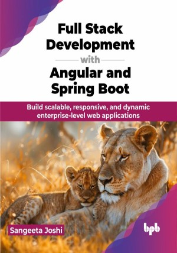

# Full Stack Development with Angular and Spring Boot

Build scalable, responsive, and dynamic enterprise-level web applications.

This is the repository for [Full Stack Development with Angular and Spring Boot
](https://bpbonline.com/products/full-stack-development-with-angular-and-spring-boot?variant=44022263742664),published by BPB Publications.

## About the Book
Full Stack Development with Angular and Spring Boot is your essential toolkit for creating dynamic, high-performance web applications. This book bridges the gap between frontend and backend development, providing a practical understanding of both domains.

This book provides a comprehensive guide to building full stack web applications with Angular and Spring Boot. It starts with basic Angular concepts like components, templates, and dependency injection, then moves on to advanced topics such as RxJS, routing, and forms. The backend section covers Spring Boot, Spring web, and Spring Data JPA for creating robust APIs and handling database interactions. It emphasizes testing, and best practices. 

Combining both frontend and backend technologies, this book helps developers build efficient, scalable, and maintainable web applications. By the end of this book, you will be proficient in both Angular and Spring Boot, capable of developing end-to-end full stack applications from scratch.

## What You Will Learn
• Learn Angular basics and build dynamic user interfaces.

• Efficiently develop single-page applications using Angular.

• Create seamless user experiences with Angular Router.

• Handle asynchronous operations effectively using RxJS.

• Build secure RESTful APIs and manage databases with Spring Boot and Spring Data JPA.
